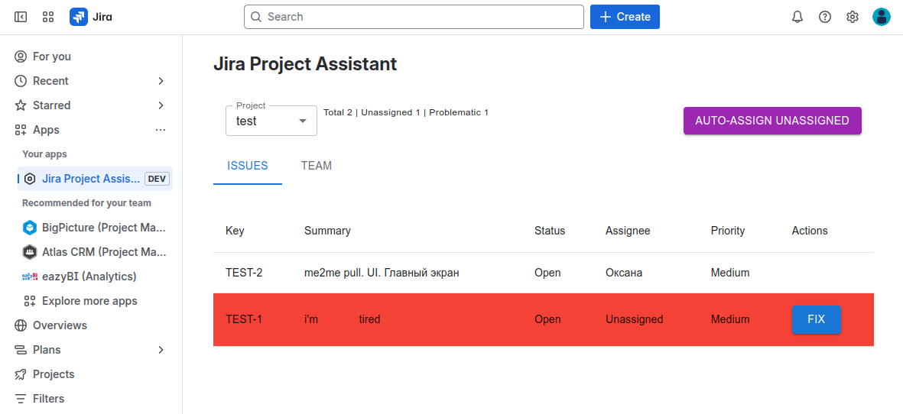
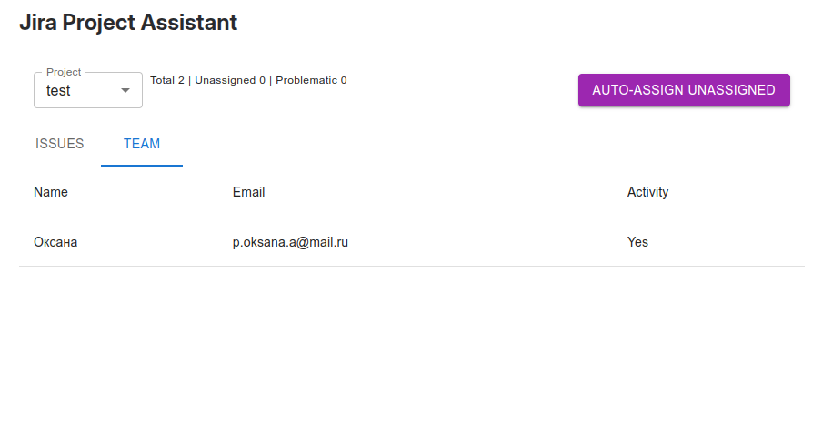
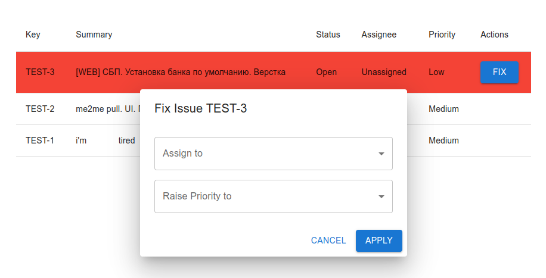

# Jira Project Assistant

This project contains a Forge app written in JavaScript in a Jira global page.

See [developer.atlassian.com/platform/forge/](https://developer.atlassian.com/platform/forge) for documentation and tutorials explaining Forge.

## Screenshots

This is the main page with selected project named "test" and two task in one:



It's team tab



Modal where you can fix problems with a task


## Requirements

See [Set up Forge](https://developer.atlassian.com/platform/forge/set-up-forge/) for instructions to get set up.

## Quick start
- Install top-level dependencies:
```
npm install
```

- Install dependencies (inside of the `static/cloud-developer-inverview` directory):
```
npm install
```

- Run app in dev mode (inside of the `static/cloud-developer-inverview` directory):
```
npm run dev
```

- Deploy your app by running:
```
forge deploy
```

- Install your app in an Atlassian site by running:
```
forge install
```

- Enable tunneling to see app's hot reloading in an Atlassian site
```
forge tunnel

### Notes
- Use the `forge deploy` command when you want to persist code changes.
- Use the `forge install` command when you want to install the app on a new site.
- Once the app is installed on a site, the site picks up the new app changes you deploy without needing to rerun the install command.

## Support

See [Get help](https://developer.atlassian.com/platform/forge/get-help/) for how to get help and provide feedback.

